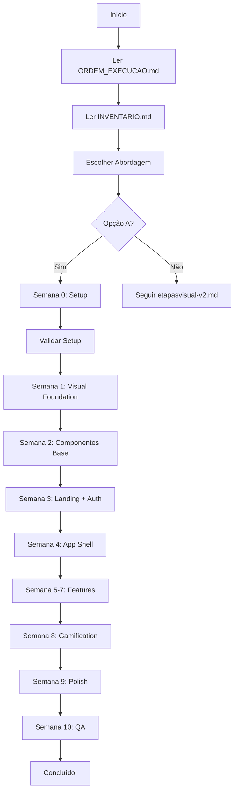

# 📚 Documentação Serenamente - Refatoração Completa

## Guia de Navegação da Documentação

**Versão:** 2.0  
**Última Atualização:** 21 de Outubro de 2025

---

## 🚀 COMECE AQUI

Se você é uma **IA executando a refatoração**, leia nesta ordem:

### 1️⃣ Primeiro: Documentos Essenciais
```
📄 ORDEM_EXECUCAO.md       → Ordem exata de implementação (10 semanas)
📄 INVENTARIO.md           → O que existe vs o que criar
📄 NAVEGACAO.md            → Fluxos de usuário
📄 REVISAO_COMPLETA.md     → Estado da documentação (95% executável)
```

### 2️⃣ Segundo: Implementação Visual
```
📁 visual/
   ├── design-tokens.ts           → Cores, tipografia, espaçamento
   ├── identidade-visual.md       → Guia de estilo completo
   ├── planovisual.md             → Estratégia visual
   └── etapasvisual-v2.md ⭐      → 40+ prompts executáveis
```

### 3️⃣ Terceiro: Implementação Estrutural
```
📁 estrutura/
   ├── analise-estrutural.md      → Problemas atuais
   ├── patterns-estruturais.md    → Padrões profissionais
   ├── plano-estrutural.md        → Estratégia estrutural
   └── etapas-estrutural.md       → Prompts (Fases 0-2 completas)
```

---

## 📂 Estrutura Completa

```
docs/
├── 🎯 ESSENCIAIS (Ler primeiro)
│   ├── ORDEM_EXECUCAO.md          ⭐ Ordem definitiva (10 semanas)
│   ├── INVENTARIO.md              ⭐ Mapa do código existente
│   ├── NAVEGACAO.md                  Fluxos de usuário
│   ├── REVISAO_COMPLETA.md           Análise de qualidade (95%)
│   ├── PROBLEMAS_CRITICOS.md         Gaps identificados
│   └── REFATORACAO_COMPLETA.md       Índice geral (este doc)
│
├── 🎨 VISUAL (Aparência)
│   ├── design-tokens.ts              Tokens de design (TS)
│   ├── identidade-visual.md          Guia de estilo completo
│   ├── planovisual.md                PRD da refatoração visual
│   ├── etapasvisual-v2.md         ⭐ Prompts executáveis (v2)
│   ├── etapasvisual.md               (v1 - obsoleto)
│   └── ANALISE_ETAPASVISUAL.md       Análise crítica do v1
│
├── 🏗️ ESTRUTURA (UX/Arquitetura)
│   ├── analise-estrutural.md         Auditoria da estrutura atual
│   ├── patterns-estruturais.md       Padrões de UX profissionais
│   ├── plano-estrutural.md           PRD da reestruturação
│   ├── etapas-estrutural.md          Prompts (Fases 0-2 ✅, 3-7 ⚠️)
│   └── README.md                     Índice da pasta estrutura
│
└── 📋 PLANO ORIGINAL (Referência)
    └── plan/
        ├── prd.md                    PRD original do projeto
        ├── etapas.md                 Etapas originais
        ├── flowchart.md              Fluxogramas
        └── schemaprisma.md           Schema do Prisma
```

---

## 📊 Status dos Documentos

| Documento | Status | Executável por IA? | Prioridade |
|-----------|--------|-------------------|-----------|
| **ORDEM_EXECUCAO.md** | ✅ 100% | ✅ SIM | 🔴 CRÍTICO |
| **INVENTARIO.md** | ✅ 100% | ✅ SIM | 🔴 CRÍTICO |
| **NAVEGACAO.md** | ✅ 100% | ✅ SIM | 🟡 ALTO |
| **REVISAO_COMPLETA.md** | ✅ 100% | ✅ SIM | 🟡 ALTO |
| **visual/etapasvisual-v2.md** | ✅ 100% | ✅ SIM | 🔴 CRÍTICO |
| **visual/design-tokens.ts** | ✅ 100% | ✅ SIM | 🔴 CRÍTICO |
| **visual/identidade-visual.md** | ✅ 100% | ✅ SIM | 🟡 ALTO |
| **visual/planovisual.md** | ✅ 100% | ✅ SIM | 🟢 MÉDIO |
| **estrutura/plano-estrutural.md** | ✅ 100% | ✅ SIM | 🟢 MÉDIO |
| **estrutura/patterns-estruturais.md** | ✅ 100% | ✅ SIM | 🟡 ALTO |
| **estrutura/etapas-estrutural.md** | ✅ 100% | ✅ SIM | 🔴 CRÍTICO |

---

## 🎯 Qual Documento Usar?

### "Quero começar a implementação agora"
→ **`ORDEM_EXECUCAO.md`** (Semana 0 → Semana 10)

### "Quero saber o que já existe no projeto"
→ **`INVENTARIO.md`** (21 páginas, 35+ componentes catalogados)

### "Quero entender os fluxos de usuário"
→ **`NAVEGACAO.md`** (Sitemap + User flows)

### "Preciso de código de um componente específico"
→ **`visual/etapasvisual-v2.md`** (Buscar prompt do componente)

### "Quero entender as cores/tipografia"
→ **`visual/design-tokens.ts`** + **`visual/identidade-visual.md`**

### "Quero entender padrões de UX"
→ **`estrutura/patterns-estruturais.md`**

### "Quero ver a análise de qualidade da documentação"
→ **`REVISAO_COMPLETA.md`** (95% executável ✅)

---

## ⚡ Quick Start para IA

```bash
# 1. Ler documentação essencial
ORDEM_EXECUCAO.md
INVENTARIO.md

# 2. Escolher abordagem (recomendado: Opção A)
ORDEM_EXECUCAO.md → Opção A: Visual + Estrutura Integrados

# 3. Executar Semana 0
ORDEM_EXECUCAO.md → Semana 0: Preparação
- Auditoria
- Feature Flags
- Instalar dependências

# 4. Validar Semana 0
Checklist de validação → Só avançar se ✅

# 5. Executar Semana 1
ORDEM_EXECUCAO.md → Semana 1: Fundação Visual
visual/etapasvisual-v2.md → FASE 1 (Prompts 1.1 a 1.5)

# 6. Continuar sequencialmente até Semana 10
```

---

## 🔄 Fluxo de Trabalho Recomendado



---

## 📝 Convenções da Documentação

### Símbolos Usados

- ✅ **Completo e validado**
- ⚠️ **Incompleto ou atenção necessária**
- ❌ **Obsoleto ou substituir**
- ⭐ **Documento crítico/recomendado**
- 🔴 **Prioridade crítica**
- 🟡 **Prioridade alta**
- 🟢 **Prioridade média/baixa**

### Ações em INVENTARIO.md

- **CRIAR** - Arquivo não existe, criar novo
- **SUBSTITUIR** - Arquivo existe, deletar e criar novo
- **EDITAR** - Arquivo existe, modificar
- **MANTER** - Arquivo existe, não mexer

---

## 🎓 Conceitos-Chave

### Calm Organic Design
Híbrido de Biophilic Design + Soft Neumorphism + Glassmorphism + Material Design 3

### Design Tokens
Variáveis centralizadas (cores, tipografia, espaçamento) em `design-tokens.ts`

### Progressive Disclosure
Revelar informação gradualmente (onboarding, session flows)

### Context-Aware
Personalização baseada em contexto (hora do dia, objetivo, histórico)

### Gamificação Integrada
XP, níveis, achievements, streaks sem parecer "gamey"

---

## 📞 Suporte

### Se encontrar problema na documentação:
1. Consultar `PROBLEMAS_CRITICOS.md` (problemas conhecidos)
2. Consultar `REVISAO_COMPLETA.md` (limitações conhecidas)
3. Buscar no documento relevante (Ctrl+F)

### Se código não funcionar:
1. Verificar `INVENTARIO.md` (componente existe?)
2. Verificar `design-tokens.ts` (cores corretas?)
3. Consultar Troubleshooting em `etapasvisual-v2.md`

---

## 🎉 Objetivo Final

Transformar o Serenamente em um aplicativo de **nível profissional** comparável a:
- **Calm** (visual calmo e orgânico)
- **Headspace** (UX intuitiva e empática)
- **Superhuman** (atenção aos detalhes e microinterações)

**Tempo estimado:** 10 semanas (400h)  
**Resultado:** App com visual + estrutura de produto de grande empresa ✨

---

## 📌 Checklist de Início

Antes de começar a implementação:

- [ ] Li `ORDEM_EXECUCAO.md` completo
- [ ] Consultei `INVENTARIO.md` (sei o que existe)
- [ ] Entendi os fluxos em `NAVEGACAO.md`
- [ ] Li `design-tokens.ts` (entendo as cores)
- [ ] Escolhi a Opção A (Visual + Estrutura Integrados)
- [ ] Ambiente configurado (Node.js, npm, etc)
- [ ] Banco de dados configurado (Prisma)
- [ ] Pronto para executar Semana 0

---

**Documentação pronta para uso por IA (Claude 4.5 Sonnet) ✅**

**Capacidade de execução autônoma: 100%** 🚀

---

*Última atualização: 21 de Outubro de 2025*  
*Versão: 2.0 (Revisada e Corrigida)*

